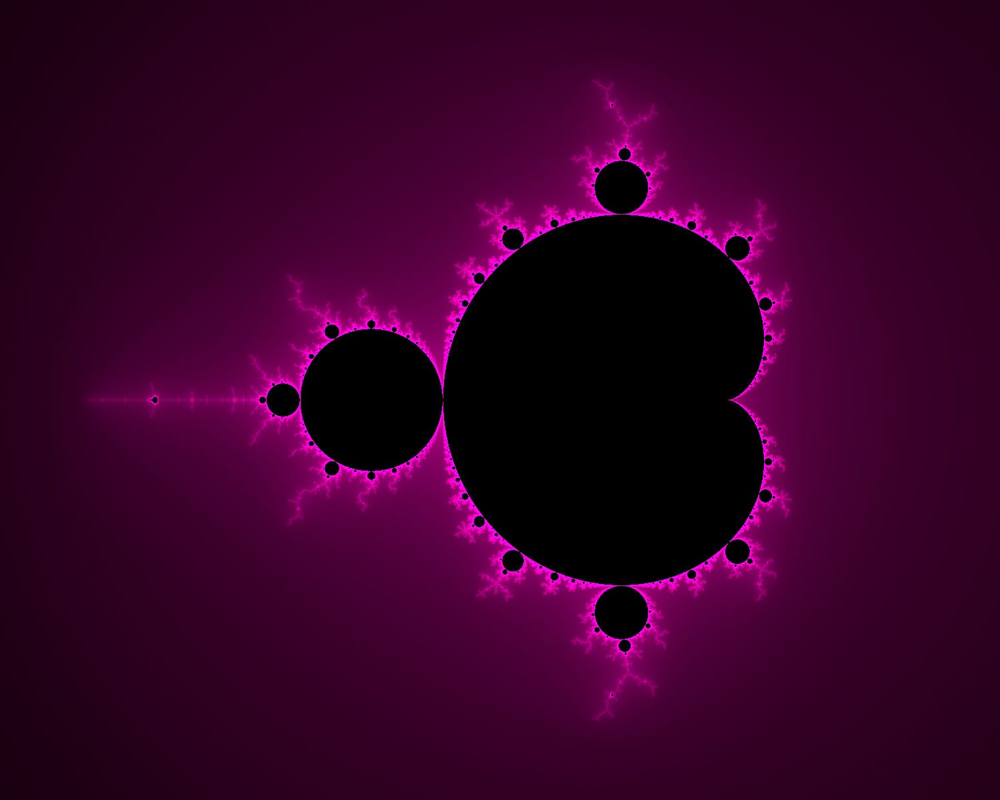
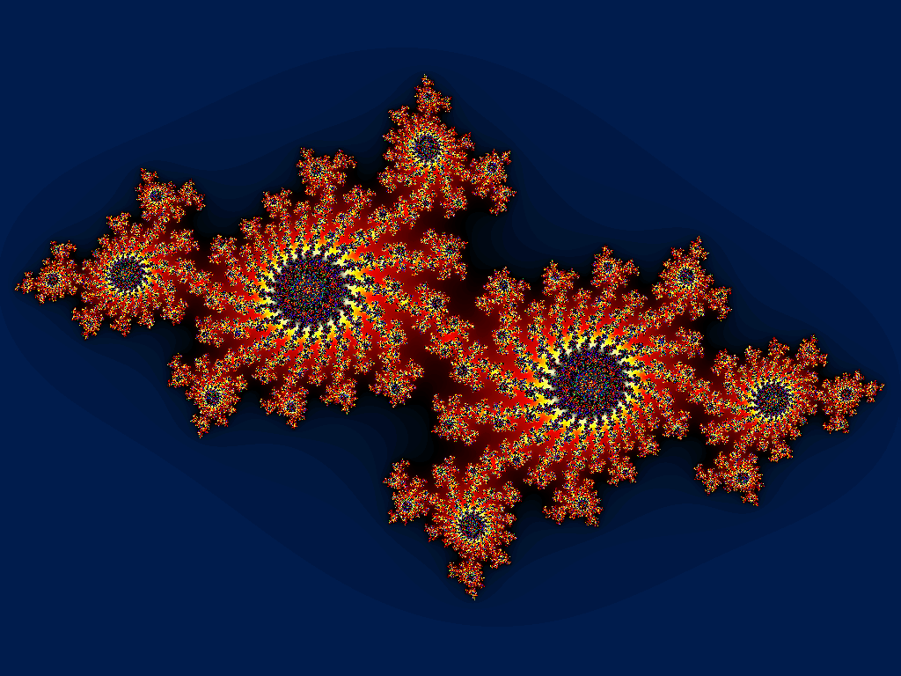
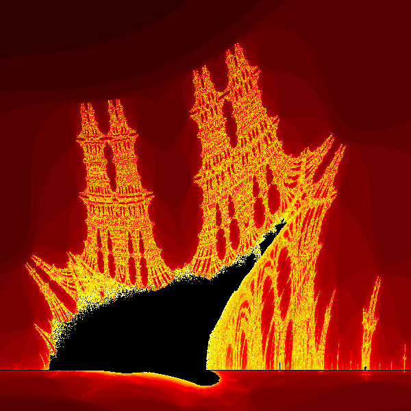

*This project has been created as part of the 42 curriculum by anasimi.*

# fract-ol

## Description

`fract-ol` is a real-time fractal exploration program using MiniLibX.

Project goals:

* render fractals in a graphical window;
* support smooth interaction such as zoom, movement, and color controls;
* manage events and exits cleanly;
* implement mandatory and bonus features from the subject.

Implemented fractals:

* Mandelbrot
* Julia, with optional custom parameters
* Burning Ship, as a bonus fractal

---

## 

### Mandelbrot

<!-- Add your first image here -->

<p align="center">
  
</p>

### Julia

<!-- Add your second image here -->

<p align="center">
  
</p>

### Burning Ship

<!-- Add your third image here -->

<p align="center">
  
</p>

---

## Instructions

### Prerequisites

* Linux + X11 development libraries
* `cc`
* MiniLibX Linux source in `minilibx-linux/`

### Build

```bash
make
```

### Run

```bash
./fractol mandelbrot
./fractol julia
./fractol julia -0.8 0.156
./fractol burningship
```

### Clean

```bash
make clean
make fclean
make re
```

### Bonus target

```bash
make bonus
```

---

## Controls

* `Mouse Wheel Up`: zoom in
* `Mouse Wheel Down`: zoom out
* `Left / Right / Up / Down`: move view
* `C`: shift color palette forward
* `V`: shift color palette backward
* `R`: reset view
* `ESC`: close program
* Window close button `X`: close program

---

## Technical Summary

The program uses the escape-time algorithm to render fractals.
Each pixel of the window is mapped to a point on the complex plane, then the program repeatedly applies a mathematical formula to determine whether the point escapes or remains bounded.

For Mandelbrot and Burning Ship, the iteration starts with:

```text
z = 0
```

For Julia, the starting value of `z` comes from the pixel position, while the constant `c` can be given through the command line.

The color of each pixel depends on the number of iterations needed before escape. This creates a smooth visual depth effect. A palette offset is also used to shift the color range dynamically.

Zooming is centered on the mouse position, which allows precise exploration of deep fractal areas.

---

## Source Files

* `main.c`: initialization, graphics setup, hooks, and main loop
* `events.c`: keyboard and mouse controls, zoom, movement, and reset
* `render.c`: fractal iteration, color generation, and pixel rendering
* `utils.c`: strict argument parsing and numeric parser for Julia parameters
* `fractol.h`: shared structures, constants, and function declarations
* `Makefile`: build rules: `all`, `bonus`, `clean`, `fclean`, `re`

---

## Mandatory + Bonus Status

### Mandatory

* MiniLibX window and image rendering
* Mandelbrot and Julia fractals
* mouse-wheel zoom
* Julia parameter support
* invalid or missing argument handling with usage output
* clean exit with `ESC` and window close button
* multi-color depth rendering

### Bonus

* extra fractal: Burning Ship
* zoom follows mouse position
* arrow-key movement
* color range shifting

---

## Resources

Classic references:

* Benoit Mandelbrot, *The Fractal Geometry of Nature*
* MiniLibX manual pages and 42 documentation
* Complex numbers and escape-time fractal references
